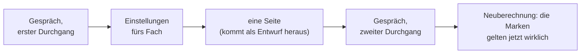

# tutor-skills

**Ein persönlicher Tutor, den du dir für dein eigenes Fach zusammenbaust** — Mathematik, React, Physik, Chemie, Geschichte.

[English](README.md) · [Русский](README.ru.md) · [简体中文](README.zh-CN.md) · [한국어](README.ko.md) · [日本語](README.ja.md) · [Français](README.fr.md) · **Deutsch**

Keine Notizsammlung, und kein Ding, das dir Bücher nacherzählt.

Du baust dir ein Lehrbuch für dein eigenes Fach. Darin stecken zwei Dinge: **Seiten** — eine pro Idee — und eine **Route**, die sagt, in welcher Reihenfolge man sie durchgeht und warum ausgerechnet in dieser.

Auf jeder Seite steht eine Marke: wie sehr man dem trauen kann, was dort steht. Gesetzt wird sie von einem Programm — es zählt Quellen und bestandene Prüfungen. Von Hand lässt sie sich nicht eintragen, und genau darin liegt der Sinn.

*So sieht eine Seite aus. Die Screenshots stammen von einer englischen Beispielseite — eine deutsche Basis sieht genauso aus, nur auf Deutsch.*

## In dreißig Sekunden

Leg einen leeren Ordner an, öffne darin Claude Code und füg das hier ein:

> Installiere und deploye dieses Projekt bei mir lokal: https://github.com/Hr0mE/tutor-skills — wir passen es zum Lernen von `<DEIN_FACH>` an.

Setz statt `<DEIN_FACH>` ein, was du lernen willst — oder **füg den Satz genau so ein, wie er dasteht**. Dann wirst du zuerst gefragt, was du lernen möchtest, bevor irgendetwas anderes gefragt wird. Auch das ist ein vorgesehener Weg.

Der Rest läuft von selbst: das Plugin wird installiert, es wird geprüft, ob dein Rechner die Prüfungen deines Fachs überhaupt ausführen kann, und dann beginnt das Gespräch. Gesprochen wird in der Sprache, in der du schreibst — auch danach wird gefragt.

Ausführlich und Schritt für Schritt: [docs/INSTALL.md](docs/INSTALL.md) *(vorerst nur auf Englisch)*.

## Was dabei entsteht

| Ordner | Was drin liegt |
|---|---|
| `wiki/concepts/` | Die Seiten. Eine pro Idee, und alle Erklärungen dieser Idee in einer einzigen Datei, hintereinander |
| `wiki/tracks/` | Die Route. In welcher Reihenfolge die Seiten durchlaufen werden und warum in dieser |

Ein Nachschlagewerk, das man von vorn bis hinten liest, wird zu Brei: alles ist da, aber wozu, ist weg. Ein Kurs, der in einzelne Karten zerschnitten wurde, verliert den Faden. Deshalb liegt hier beides: eine Seite lässt sich einzeln herausnehmen und in einem anderen Thema wiederverwenden, und die Route hält den Zusammenhang zwischen ihnen.

**Dieselbe Sache erklärt eine Seite dreimal hintereinander**, und der Übergang von einer Erklärung zur nächsten ist genau das, was Lernen ausmacht:

- **am Alltagsbeispiel** — womit aus dem gewöhnlichen Leben es sich vergleichen lässt, und unmittelbar danach ein Absatz darüber, wo der Vergleich lügt;
- **wie man es benutzt** — die Definition und das kleinste Beispiel, für das die Sache überhaupt existiert;
- **vollständig** — die exakte Aussage mit allen Bedingungen und wie es innen funktioniert.

Danach kommt die Praxis. Zuerst zwei, drei kurze Aufwärmübungen, dann die Aufgaben. Zu jeder Aufgabe gehören drei eingeklappte Hinweise: du klappst einen auf, und nur dann, wenn du feststeckst. Die Lösungen liegen in einer eigenen Datei, damit das Auge nicht zufällig darüberstolpert.

## Drei Ideen, die sich mitzunehmen lohnen, auch wenn du das hier nie installierst

**Ein Vergleich ohne genannte Grenzen ist schlimmer als gar kein Vergleich.** Nach dem Alltagsbeispiel muss ein Absatz stehen, der sagt, wo es aufhört zu tragen. Ohne ihn setzt sich das Beispiel als Tatsache fest und stört jahrelang — unsichtbar, denn es hat nie angekündigt, eine Vereinfachung zu sein. Hier ist das keine Empfehlung: eine Seite mit Vergleich und ohne Grenzen besteht die Prüfung nicht.

**Die Vertrauensmarke setzt ein Skript, niemals ein Mensch.** Sie misst nicht, wie sicher sich der Verfasser war, sondern das Zählbare: wie viele Quellen, wie viele bestandene Prüfungen. In dem Moment, in dem man sie von Hand setzen darf, klettert sie nach oben und bedeutet nichts mehr. Eine aufgeblähte Skala ist schlimmer als gar keine, weil ihr trotzdem geglaubt wird.

**Zwei Quellen sind nicht immer zwei Quellen.** Zwei Lehrbücher, die dasselbe Werk nacherzählen, sind eine Quelle, zweimal gezählt. Zwei Artikel über dieselbe Seite Dokumentation ebenso. Was als zwei verschiedene Quellen zählt, wird pro Fach entschieden: zwei verschiedene Beweise, zwei Zeugen, die einander nicht gelesen haben, oder ausgeführter Code gegen das, was die Dokumentation verspricht. Das Programm zählt nur Quellen, die sich nicht selbst als abgeleitet ausweisen.

## Woher die Einstellungen deines Fachs kommen

Das Plugin kann unterrichten, aber dein Fach kennt es nicht: was hier als Quelle gilt, was als Prüfung, und woran man sieht, dass ein Thema abgeschlossen ist. Das klärt ein Gespräch — und das Gespräch läuft **in zwei Durchgängen, mit einer echten Seite dazwischen**.

Der Schnitt liegt nicht zufällig dort. Der erste Durchgang fragt, was sich vorher wissen lässt. Der zweite fragt, was erst das echte Material zeigt. Die Frage „was zählt in deinem Fach als zwei verschiedene Quellen?“ wirkt klar — bis man ernsthaft versucht, sie zu beantworten: vor der ersten Seite klingt die Antwort plausibel und ist falsch, danach ist sie echt.

Eine Seite, die vor dem zweiten Durchgang geschrieben wurde, gilt als Entwurf, gleich womit sie gestützt ist: die Regeln, an denen sie zu messen wäre, gab es damals noch nicht. Der zweite Durchgang nimmt diese Deckelung weg und rechnet alles neu.

Die Methode selbst liegt im Plugin und wird mit ihm aktualisiert. In deinen Ordner kommen nur die Einstellungen fürs Fach. Wird die Methode besser, erreicht die Verbesserung deshalb jede Basis, die du schon begonnen hast — statt dir fünf eingefrorene Kopien zu hinterlassen.

## Aufgaben

Drei pro Seite, jede mit ihrer eigenen Arbeit: **die Definition halten** · **das Ergebnis anwenden** · **die Bedingung brechen** — eine Voraussetzung wegnehmen und schauen, was einstürzt. Die dritte kuriert die häufigste Verwechslung in jedem Fach: welche Bedingung die Konstruktion trägt und welche nur dabeisteht.

Eine Aufgabenstellung allein reicht nicht. Wer feststeckt und nichts zum Festhalten hat, schließt die Seite. Deshalb stehen vor der Aufgabe **kurze Übungen** — keine Teile der Lösung, sondern die Prüfung, ob das nötige Werkzeug in deiner Hand liegt. Und in der Aufgabe selbst **drei Hinweise in aufsteigender Stärke**: wohin schauen · womit · fast die ganze Konstruktion, es bleibt nur, sie zu Ende zu rechnen.

## Wenn du mit einem Satz nicht einverstanden bist

Der Einwand wird in den Ordner `audit/` geschrieben, nicht in den Chat. Was in einem Gespräch gesagt wird, stirbt mit dem Gespräch. Eine Anmerkung in `audit/` hängt an einer bestimmten Stelle einer bestimmten Seite, wird als eigene Arbeit bearbeitet und mit ihrer Auflösung archiviert — **abgelehnte eingeschlossen, samt Begründung der Ablehnung**. Gelöscht wird nichts.

## Wenn du aus Büchern lernst

Für Fächer, die man aus Büchern lernt, schaltet sich das Bücher-Werkzeug dazu: Suche über alle deine Bücher auf einmal und automatische Umrechnung der Seitenzahlen. Seite 91 der Datei ist etwa Seite 79 des Buches; eine Fundstelle, die das ignoriert, geht um zwölf Seiten daneben, und dann kann sie niemand mehr nachschlagen.

Der Text, den das Programm aus einem Scan zieht, taugt nur zum Auffinden der Stelle. Alles, was als Zitat in die Basis kommt, wird am Bild der Seite mit den Augen abgeglichen: die Texterkennung zerlegt regelmäßig Indizes, Quantoren und griechische Buchstaben, und eine zerlegte Formel mit der Marke „geprüft“ ist das Schlimmste, was dieses System hervorbringen kann.

## Was es bislang nur auf Englisch gibt

Übersetzt ist hier der Hauptstrang. Die Einzelheiten liegen in den englischen Dateien:

- [Die fünf Prüfungsarten](README.md#the-five-types-of-check) — von „bewiesen“ bis „das Zitat steht wirklich auf dieser Seite“, und warum keine sechste dazukommt.
- [docs/INSTALL.md](docs/INSTALL.md) — Installation, beide Gespräche vollständig an einem echten Beispiel, die täglichen Befehle und was zu tun ist, wenn etwas klemmt.
- [NOTICE](NOTICE) — worauf das hier steht und wem wir es schulden.

<b>An den Agenten, der das ausrollt</b>

Die Anweisungen zum Ausrollen stehen im englischen README, Abschnitt [*For the agent deploying this*](README.md#quick-start). Sie werden **absichtlich nicht übersetzt**: das sind Anweisungen an das Modell, kein Text zum Lesen. Sechs übersetzte Kopien derselben Anweisungen laufen bei der ersten Korrektur auseinander, und die auseinandergelaufene fällt immer zuletzt auf.

Übersetzt wird, was ein Mensch liest. In welcher Sprache mit der lernenden Person gesprochen wird, entscheidet nicht die Sprache der Datei: das ist der eigene erste Schritt von `/learning-init`, und die Voreinstellung ist die Sprache, in der sie selbst schreibt.

## Stand

**Frühe Version.** Die Methode ist aus einem zu Ende geführten Mathematik-Kurs gewachsen und wird gerade so umgebaut, dass sie für jedes Fach taugt. An den Einstellungen wird sich noch etwas ändern.

Gebraucht werden Claude Code und Python 3.10 oder neuer. `make` ist nicht nötig und existiert unter Windows gar nicht — dort läuft alles über `python tutor.py <Befehl>`. MIT-Lizenz.
