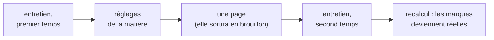

# tutor-skills

**Un professeur particulier que tu assembles pour ta propre matière** — mathématiques, React, physique, chimie, histoire.

[English](README.md) · [Русский](README.ru.md) · [简体中文](README.zh-CN.md) · [한국어](README.ko.md) · [日本語](README.ja.md) · **Français** · [Deutsch](README.de.md)

Ce ne sont pas des notes, et ce n'est pas un résumeur de livres.

Tu construis ton propre manuel, pour ta propre matière. Il contient deux choses : des **pages** — une par idée — et un **parcours**, qui dit dans quel ordre les traverser et pourquoi c'est cet ordre-là.

Chaque page porte une marque : à quel point on peut se fier à ce qui y est écrit. C'est un programme qui l'attribue — il compte les sources et les vérifications réussies. Personne ne peut l'écrire à la main, et c'est tout l'intérêt.

*Voilà à quoi ressemble une page. Les captures viennent d'une page d'exemple en anglais — une base en français a exactement la même allure, en français.*

## En trente secondes

Crée un dossier vide, ouvre Claude Code dedans et colle ceci :

> Installe et déploie ce projet en local : https://github.com/Hr0mE/tutor-skills — on va l'adapter pour apprendre `<TA_MATIÈRE>`.

Remplace `<TA_MATIÈRE>` par ce que tu veux apprendre — ou **colle la phrase telle quelle**. On te demandera alors ce que tu veux apprendre avant de te demander quoi que ce soit d'autre. C'est un chemin prévu, pas une erreur.

Le reste se fait tout seul : le plugin s'installe, la machine est testée pour savoir si elle peut faire tourner les vérifications dont ta matière a besoin, puis l'entretien commence. On te parlera dans la langue dans laquelle tu écris — la langue fait aussi l'objet d'une question.

Le détail, étape par étape : [docs/INSTALL.md](docs/INSTALL.md) *(en anglais pour l'instant)*.

## Ce que ça produit

| Dossier | Ce qu'il contient |
|---|---|
| `wiki/concepts/` | Les pages. Une par idée, et toutes les explications de cette idée dans un seul fichier, à la suite |
| `wiki/tracks/` | Le parcours. Dans quel ordre traverser les pages, et pourquoi cet ordre |

Un ouvrage de référence lu d'un bout à l'autre tourne à la bouillie : tout y est, mais on ne sait plus pourquoi. Un cours découpé en fiches isolées perd le fil. Il y a donc les deux ici : une page se prend séparément et se réutilise dans un autre sujet, et le parcours tient le raisonnement entre elles.

**Une page explique la même chose trois fois de suite**, et le passage d'une explication à la suivante, c'est justement ça, apprendre :

- **avec un exemple du quotidien** — à quoi ça ressemble dans la vie courante, suivi immédiatement d'un paragraphe sur l'endroit où l'exemple ment ;
- **l'usage réel** — la définition et le plus petit exemple qui montre pourquoi la chose existe ;
- **en entier** — l'énoncé exact avec toutes ses conditions, et comment ça fonctionne à l'intérieur.

Ensuite vient la pratique. D'abord deux ou trois exercices courts pour se chauffer, puis les problèmes. Chaque problème porte trois indices repliés : tu en déplies un seul, et seulement quand tu bloques. Les réponses vivent dans un fichier à part, pour que l'œil ne tombe pas dessus par hasard.

## Trois idées à emporter, même si tu n'installes jamais ça

**Une comparaison sans limites annoncées est pire que pas de comparaison du tout.** Après l'exemple du quotidien doit venir un paragraphe qui dit où il cesse de tenir. Sans lui, l'exemple s'installe comme un fait et gêne pendant des années — sans qu'on le voie, puisqu'il n'a jamais annoncé qu'il était une simplification. Ici ce n'est pas un conseil : une page qui porte une comparaison sans ses limites ne passe pas la vérification.

**La marque de confiance est écrite par un script, jamais par un humain.** Elle ne mesure pas l'assurance de celui qui a rédigé, mais ce qui se compte : combien de sources, combien de vérifications réussies. Dès l'instant où on peut la poser à la main, elle grimpe et cesse de vouloir dire quoi que ce soit. Une échelle gonflée est pire qu'une absence d'échelle, parce qu'on continue de lui faire confiance.

**Deux sources ne font pas toujours deux sources.** Deux manuels qui redisent le même ouvrage, c'est une source comptée deux fois. Deux articles sur la même page de documentation aussi. Ce qui compte comme deux sources distinctes se décide matière par matière : deux démonstrations différentes, deux témoignages qui ne se sont pas lus, ou du code exécuté contre ce que la documentation promet. Le programme ne compte que les sources qui ne se déclarent pas dérivées d'une autre.

## D'où viennent les réglages de ta matière

Le plugin sait enseigner, mais il ne connaît pas ta matière : ce qui compte ici comme source, ce qui compte comme vérification, et à quoi on voit qu'un sujet est bouclé. Cela se règle dans un entretien — et l'entretien se fait **en deux temps, avec une vraie page écrite entre les deux**.

La coupure n'est pas placée au hasard. Le premier temps demande ce qu'on peut savoir d'avance. Le second demande ce que seule la matière réelle peut apprendre. La question « qu'est-ce qui compte comme deux sources distinctes chez toi ? » paraît claire jusqu'au moment où on essaie d'y répondre sérieusement : avant la première page, la réponse est plausible et fausse ; après, elle est vraie.

Une page écrite avant le second temps est marquée brouillon, quel que soit ce qui la soutient : les règles qui devraient la juger n'existaient pas encore. Le second temps lève ce plafond et recalcule tout.

La méthode elle-même vit dans le plugin et se met à jour avec lui. Dans ton dossier n'atterrissent que les réglages de la matière. Donc quand la méthode s'améliore, l'amélioration atteint toutes les bases que tu as déjà commencées — au lieu de te laisser avec cinq copies figées.

## Les problèmes

Trois par page, chacun avec son travail : **tenir la définition** · **appliquer le résultat** · **casser la condition** — retirer une hypothèse et regarder ce qui s'effondre. Le troisième soigne la confusion la plus fréquente dans n'importe quelle matière : quelle condition porte la construction, et laquelle n'est là que pour la forme.

Un énoncé seul ne suffit pas. Celui qui bloque sans rien à quoi se raccrocher ferme la page. Avant le problème viennent donc des **exercices d'approche** — ce ne sont pas des morceaux de la solution, mais la vérification que l'outil est bien dans ta main. Et dans le problème, **trois indices de plus en plus précis** : où regarder · avec quel outil · presque toute la construction, il ne reste qu'à finir le calcul.

## Si tu n'es pas d'accord avec une phrase

L'objection s'écrit dans le dossier `audit/`, pas dans le chat. Ce qui est dit dans une conversation meurt avec elle. Une remarque dans `audit/` est accrochée à un passage précis d'une page précise, traitée comme un travail à part entière, puis archivée avec sa résolution — **y compris les remarques rejetées, avec le motif du rejet**. Rien n'est supprimé.

## Si tu apprends dans des livres

Pour les matières qui s'apprennent dans des livres, un outillage s'active : la recherche dans tous tes livres d'un coup et le calcul automatique du décalage de pagination. La page 91 du fichier est, disons, la page 79 du livre ; une référence qui l'ignore se trompe de douze pages, et plus personne ne peut la vérifier.

Le texte que le programme tire d'un scan ne sert qu'à retrouver l'endroit. Tout ce qui entre dans la base sous forme de citation est confronté à l'image de la page, à l'œil : la reconnaissance de caractères abîme régulièrement les indices, les quantificateurs et les lettres grecques, et une formule abîmée portant la marque « vérifié » est la pire chose que ce système puisse produire.

## Ce qui n'existe encore qu'en anglais

L'essentiel est traduit ici. Le détail est dans les fichiers anglais :

- [Les cinq types de vérification](README.md#the-five-types-of-check) — de « démontré » à « la citation est bien sur cette page », et pourquoi il n'y en aura pas un sixième.
- [docs/INSTALL.md](docs/INSTALL.md) — l'installation, les deux entretiens en entier sur un exemple réel, les commandes du quotidien et quoi faire quand ça coince.
- [NOTICE](NOTICE) — sur quoi tout cela est bâti, et à qui nous le devons.

<b>À l'agent qui déploie ceci</b>

Les instructions de déploiement sont dans le README anglais, section [*For the agent deploying this*](README.md#quick-start). Elles ne sont **délibérément pas traduites** : ce sont des instructions destinées au modèle, pas un texte à lire. Six copies traduites des mêmes instructions divergent dès la première correction, et celle qui a divergé est toujours repérée en dernier.

Ce qui est traduit, c'est ce qu'un humain lit. La langue dans laquelle on parle à l'apprenant ne dépend pas de la langue du fichier : c'est la toute première étape de `/learning-init`, et la valeur par défaut est la langue dans laquelle l'apprenant écrit lui-même.

## État

**Version précoce.** La méthode est née d'un parcours de mathématiques mené jusqu'au bout et se généralise en ce moment à n'importe quelle matière. Les réglages bougeront encore.

Il faut Claude Code et Python 3.10 ou plus récent. `make` n'est pas obligatoire, et sous Windows il n'existe pas du tout — là-bas tout passe par `python tutor.py <commande>`. Licence MIT.
