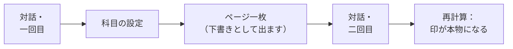

# tutor-skills

**自分の科目に合わせて組み立てる、専属の家庭教師** — 数学、React、物理、化学、歴史。

[English](README.md) · [Русский](README.ru.md) · [简体中文](README.zh-CN.md) · [한국어](README.ko.md) · **日本語** · [Français](README.fr.md) · [Deutsch](README.de.md)

メモ帳でもなければ、本を要約してくれる道具でもありません。

自分の科目の教科書を、自分で建てるための道具です。中身は二つ。**ページ** — 一つの考えにつき一枚 — と、**ルート** です。ルートは、どの順番で読むのか、そしてなぜその順番なのかを言葉にします。

どのページにも印が一つ付きます。そこに書かれていることをどれだけ信じてよいか、という印です。付けるのはプログラムで、数えるのは出典の数と通った検査の数です。人が手で書き込むことはできません。そこが肝心なところです。

*ページはこう見えます。スクリーンショットは英語のサンプルページのもので、日本語で作った場合も文字が日本語になるだけで見た目は同じです。*

## 30 秒で始める

空のフォルダを作り、その中で Claude Code を開いて、次の一文を貼り付けてください。

> このプロジェクトをローカルにインストールして立ち上げて: https://github.com/Hr0mE/tutor-skills — `<あなたの科目>` を学ぶ用に調整していきます。

`<あなたの科目>` のところに学びたいものを書いてください。あるいは **そのまま貼り付けても構いません。** その場合は、ほかの何を聞くよりも先に「何を学びたいのか」を尋ねます。それも想定された手順です。

あとは自動で進みます。プラグインを入れ、この科目に必要な検査がこの機械で動くかを確かめ、対話を始めます。対話はあなたが書いている言語で行われます — 言語についても尋ねられます。

手順を追った詳しい説明： [docs/INSTALL.md](docs/INSTALL.md) *（今のところ英語のみ）*。

## 何ができあがるのか

| フォルダ | 中身 |
|---|---|
| `wiki/concepts/` | ページ。一つの考えにつき一枚、その考えの説明はすべて同じファイルの中に続けて |
| `wiki/tracks/` | ルート。どの順でページを通るのか、そしてなぜその順なのか |

通しで読む参考書は粥になります。すべて載っているのに、何のためかが消えるからです。ばらばらのカードに切られた講義は筋を失います。だからここには両方あります。ページは単体で取り出して別の主題でも使え、ルートがその間の筋を保ちます。

**同じことを、一枚のページの中で三度説明します。** そして説明から説明へ移るその瞬間こそが、学ぶということです。

- **身近な例で** — 生活の中の何に似ているか、そしてすぐ後に、その例がどこで嘘になるかの段落；
- **実際の使い方** — 定義と、それが何のために在るのかが分かる最小の例；
- **完全な形** — 条件をすべて備えた正確な言明と、内部でどう動いているか。

その先が練習です。まず短い準備問題が二つ三つ、それから本題。問題ごとに、折りたたまれたヒントが三つ付いています。行き詰まったときに一つずつ開いてください。答えは別のファイルにあり、目に飛び込んでくることはありません。

## 入れないとしても持ち帰る価値のある三つの考え

**限界を書いていないたとえは、たとえが無いより悪い。** 身近な例のあとには、それがどこから通用しなくなるかを書いた段落が必ず要ります。それが無いと、例は事実として記憶され、そのあと何年も静かに邪魔をします — 自分が単純化だと名乗ったことが一度も無いからです。ここではこれは推奨ではありません。たとえがあって限界の無いページは、検査を通りません。

**「どれだけ信じてよいか」の印は、人ではなくプログラムが付けます。** 数えるのは書いた人の自信ではなく、数えられるもの — 出典がいくつ、通った検査がいくつ、です。手で書けるようにした瞬間、その印は上へ這い上がり、何も意味しなくなります。水増しされた印は、印が無いより悪い。それでも人は信じてしまうからです。

**出典が二つあっても、二つとは限りません。** 同じ一冊の本を言い換えただけの教科書二冊は、一つの出典を二度数えただけです。同じドキュメントの一ページを解説した記事二本も同じです。何を別々の出典と見なすかは科目ごとに決めます。異なる二つの証明かもしれないし、互いを読んでいない二人の証言かもしれないし、ドキュメントの約束に対して実際にコードを走らせることかもしれません。プログラムが数えるのは、「別のものの言い直し」と申告されていない出典だけです。

## 科目ごとの設定はどこから来るのか

プラグインは教え方を知っていますが、あなたの科目は知りません。ここでは何が出典なのか、何が検査なのか、何をもって一つの主題を終えたと言うのか — それを対話で決めます。対話は **二回に分かれ、その間にあなたが本物のページを一枚書きます。**

区切りの位置は適当ではありません。一回目に聞くのは、事前に分かることです。二回目に聞くのは、本物の材料に触れて初めて見えることです。「あなたの科目で、別々の出典二つとは何か」という問いは、真面目に答えようとするまでは明快に見えます。最初の一枚を書く前の答えはもっともらしく、そして外れています。書いたあとの答えが本物です。

二回目より前に書かれたページは、何に支えられていようと下書きと記されます。それを判定するための規則が、その時点ではまだ存在しなかったからです。二回目がその上限を外し、すべてを計算し直します。

方法そのものはプラグインの中にあり、プラグインとともに更新されます。あなたのフォルダに置かれるのは科目の設定だけです。だから方法が良くなったとき、その改善はすでに始めているすべての資料に届きます — 凍りついた複製が五つ残る、ということになりません。

## 問題

ページごとに三つ、それぞれ役割が違います。**定義を手に持つ** ・ **結果を使う** ・ **条件を壊す** — 前提を一つ外して、何が崩れるかを見る。三つ目が治すのは、どの科目でも最もよくある取り違えです。どの条件が構造を支えていて、どの条件がただ置かれているだけなのか。

問題文だけでは足りません。行き詰まって掴むものが無い人は、ページを閉じてしまいます。だから問題の前に **短い準備問題** があります。解答の断片ではなく、必要な道具が手にあるかどうかの確認です。そして問題の中には **段階の違う三つのヒント** があります。どこを見るか ・ 何を使うか ・ ほとんど全部、あとは答えを出すだけ。

## 書かれていることに納得できないとき

反論はチャットではなく `audit/` フォルダに書きます。会話で言ったことは、その会話とともに消えます。`audit/` の指摘は特定のページの特定の箇所に結び付けられ、独立した一つの仕事として処理され、処理結果とともに保管されます — **却下されたものも、却下の理由とともに。** 消えるものはありません。

## 本で学ぶ場合

本で学ぶ科目には、本を扱う機能が入ります。手持ちの本すべてを一度に検索でき、ページ番号は自動で換算されます。ファイルの 91 ページが、本では 79 ページということがあります。それを踏まえない引用は十二ページずれ、誰にも確かめられません。

スキャンからプログラムが読み取った文字は、場所を見つけるためだけに使います。引用として資料に入るものはすべて、ページの画像と目で突き合わせます。文字認識は添字や記号やギリシャ文字をよく壊しますし、壊れた数式が「確認済み」の印を付けている状態こそ、この仕組みが出しうる最悪の結果です。

## いまは英語だけの部分

ここに訳したのは幹です。細部は英語のファイルにあります。

- [五つの検査](README.md#the-five-types-of-check) — 「証明された」から「引用が確かにそのページにある」まで、そして六つ目を作らない理由。
- [docs/INSTALL.md](docs/INSTALL.md) — インストール、二回の対話の実例、日々のコマンド、うまくいかないときの対処。
- [NOTICE](NOTICE) — これが何の上に立っているか、誰に負っているか。

<b>これを配置するエージェントへ</b>

配置の手順は英語 README の [*For the agent deploying this*](README.md#quick-start) にあります。そこは **意図的に翻訳しません。** 人が読む文章ではなく、モデルへの指示だからです。同じ指示の訳が六つあれば、最初の修正で食い違い始め、食い違った一つは必ず最後に見つかります。

訳すのは人が読む部分です。学習者とどの言語で話すかはファイルの言語では決まりません。それは `/learning-init` の独立した最初の手順で、既定値は学習者自身が書いている言語です。

## 現在の状態

**初期版です。** この方法は、走り切った数学の一課程から育ち、いまはどの科目にも使えるように作り直している最中です。設定はこれからも変わります。

Claude Code と Python 3.10 以上が必要です。`make` は必須ではなく、Windows にはそもそもありません — そこではすべて `python tutor.py <コマンド>` を通ります。MIT ライセンス。
