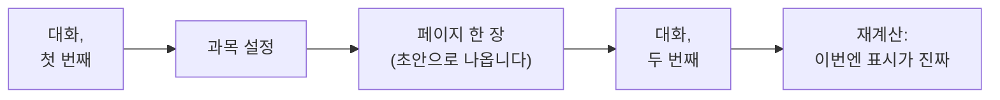

# tutor-skills

**자기 과목에 맞게 직접 조립하는 개인 교사** — 수학, React, 물리, 화학, 역사.

[English](README.md) · [Русский](README.ru.md) · [简体中文](README.zh-CN.md) · **한국어** · [日本語](README.ja.md) · [Français](README.fr.md) · [Deutsch](README.de.md)

메모 앱도 아니고, 책을 대신 요약해 주는 물건도 아닙니다.

자기 과목의 교재를 스스로 짓는 도구입니다. 안에는 두 가지가 있습니다. 하나는 **페이지** — 아이디어 하나에 한 장 — 이고, 다른 하나는 **경로** 입니다. 경로는 어떤 순서로 읽어야 하는지, 그리고 왜 하필 그 순서인지를 말해 줍니다.

페이지마다 표시가 하나 붙습니다. 여기 적힌 내용을 얼마나 믿어도 되는지에 대한 표시입니다. 그 표시는 프로그램이 붙입니다 — 출처의 수와 통과한 검사의 수를 세서요. 사람이 손으로는 못 씁니다. 바로 그 점이 핵심입니다.

*페이지는 이렇게 생겼습니다. 스크린샷은 영어 예시 페이지에서 찍은 것이고, 한국어로 만든 자료도 글자만 한국어일 뿐 똑같이 생겼습니다.*

## 30 초면 시작합니다

빈 폴더를 하나 만들고 그 안에서 Claude Code 를 연 다음, 아래 문장을 붙여 넣으세요.

> 이 프로젝트를 내 컴퓨터에 설치하고 배포해 줘: https://github.com/Hr0mE/tutor-skills — `<배울_주제>` 를 공부하는 용도로 맞출 거야.

`<배울_주제>` 자리에 배우고 싶은 것을 적으세요. 아니면 **문장을 그대로 붙여 넣어도 됩니다.** 그러면 다른 것을 묻기 전에 무엇을 배우고 싶은지부터 물어봅니다. 그것도 정상적인 경로입니다.

그다음은 알아서 진행됩니다. 플러그인을 설치하고, 이 과목에 필요한 검사를 이 컴퓨터가 돌릴 수 있는지 확인한 뒤, 대화를 시작합니다. 대화는 당신이 쓰는 언어로 이루어집니다 — 언어에 대해서도 물어봅니다.

단계별 자세한 설명: [docs/INSTALL.md](docs/INSTALL.md) *(아직 영어만 있습니다)*.

## 무엇이 만들어지나

| 폴더 | 안에 들어가는 것 |
|---|---|
| `wiki/concepts/` | 페이지. 아이디어 하나에 한 장, 그 아이디어에 대한 설명은 전부 한 파일 안에 차례로 |
| `wiki/tracks/` | 경로. 페이지를 어떤 순서로 지나가는지, 그리고 왜 그 순서인지 |

처음부터 끝까지 읽는 참고서는 죽이 됩니다. 다 들어 있지만 무엇을 위한 것인지가 사라지니까요. 낱장 카드로 잘린 강의는 줄거리를 잃습니다. 그래서 여기에는 둘 다 있습니다. 페이지는 따로 떼어 다른 주제에서 다시 쓸 수 있고, 경로가 그 사이의 논리를 붙들어 줍니다.

**같은 것을 한 페이지 안에서 세 번 설명합니다.** 그리고 설명에서 설명으로 넘어가는 그 지점이 바로 배움입니다.

- **일상적인 예로** — 생활 속 무엇과 닮았는지, 그리고 바로 이어서 그 예가 어디서 어긋나는지;
- **실제로 쓰는 방식** — 정의와, 그것이 왜 필요한지를 보여 주는 가장 작은 예;
- **완전한 형태** — 조건을 모두 갖춘 정확한 진술과, 안에서 어떻게 돌아가는지.

그다음은 연습입니다. 먼저 몸을 푸는 짧은 문제 두세 개, 그다음 본 문제. 문제마다 접혀 있는 힌트가 세 개 있습니다. 막혔을 때 하나씩만 펼치면 됩니다. 답은 다른 파일에 있어서 눈에 먼저 걸리지 않습니다.

## 설치하지 않더라도 가져갈 만한 세 가지

**경계를 적지 않은 비유는 비유가 없는 것보다 나쁩니다.** 일상적인 예 뒤에는 그 예가 어디서부터 통하지 않는지를 적은 문단이 반드시 따라와야 합니다. 그 문단이 없으면 예시가 사실로 기억되고, 그 뒤로 몇 년 동안 조용히 방해합니다 — 자기가 단순화였다고 말한 적이 없으니까요. 여기서 이것은 권고가 아닙니다. 비유는 있는데 경계가 없는 페이지는 검사를 통과하지 못합니다.

**「얼마나 믿을 수 있는가」 표시는 사람이 아니라 프로그램이 붙입니다.** 그 표시가 세는 것은 쓴 사람의 확신이 아니라 셀 수 있는 것입니다. 출처가 몇 개인지, 검사가 몇 개 통과했는지. 손으로 쓸 수 있게 되는 순간 그 표시는 위로 기어오르고, 아무 의미도 없어집니다. 부풀려진 표시는 아예 없는 것보다 나쁩니다. 사람들은 여전히 그것을 믿기 때문입니다.

**출처 두 개가 언제나 출처 두 개인 것은 아닙니다.** 같은 책을 옮겨 적은 교과서 두 권은 하나의 출처를 두 번 센 것입니다. 같은 문서 페이지를 설명한 기사 두 편도 마찬가지입니다. 무엇을 서로 다른 출처로 볼지는 과목마다 따로 정합니다. 서로 다른 두 증명일 수도, 서로를 읽은 적 없는 두 증언일 수도, 문서가 약속한 것과 실제로 돌려 본 코드일 수도 있습니다. 프로그램은 「다른 곳을 옮긴 것」이라고 표시되지 않은 출처만 셉니다.

## 과목별 설정은 어디서 오나

플러그인은 가르치는 법은 알지만 당신의 과목은 모릅니다. 여기서 무엇이 출처인지, 무엇이 검사인지, 무엇을 보고 한 주제를 끝냈다고 할지 — 이것은 대화로 알아냅니다. 그리고 그 대화는 **두 번에 나누어 진행되며, 그 사이에 진짜 페이지를 한 장 씁니다.**

끊는 자리는 아무렇게나 고른 것이 아닙니다. 첫 번째 대화는 미리 알 수 있는 것을 묻고, 두 번째 대화는 실제 자료를 만져 봐야 보이는 것을 묻습니다. 「당신의 과목에서 서로 다른 출처 두 개란 무엇인가?」라는 질문은 진지하게 답해 보기 전까지만 분명해 보입니다. 첫 페이지를 쓰기 전의 답은 그럴듯하지만 틀리고, 쓰고 난 뒤의 답이 진짜입니다.

두 번째 대화 전에 쓴 페이지는 무엇으로 뒷받침되든 초안으로 표시됩니다. 그 페이지를 판단할 규칙이 그때는 아직 없었으니까요. 두 번째 대화가 그 상한을 걷어 내고 전부 다시 계산합니다.

방법 자체는 플러그인 안에 있고 플러그인과 함께 갱신됩니다. 당신의 폴더에 들어가는 것은 과목 설정뿐입니다. 그래서 방법이 좋아지면 이미 시작해 둔 모든 자료가 그 개선을 받습니다 — 얼어붙은 복사본 다섯 개가 남는 대신에요.

## 문제

페이지마다 세 개, 각각 맡은 일이 다릅니다. **정의를 붙들기** · **결과를 써먹기** · **조건을 부수기** — 전제를 하나 빼고 무엇이 무너지는지 보기. 세 번째는 어느 과목에서나 가장 흔한 혼동을 고칩니다. 어떤 조건이 구조를 떠받치고 있고, 어떤 조건이 그냥 놓여 있는지.

문제만 있어서는 부족합니다. 막혔는데 붙잡을 것이 없는 사람은 그냥 페이지를 닫습니다. 그래서 문제 앞에는 **짧은 준비 연습** 이 있습니다. 풀이의 조각이 아니라, 필요한 도구가 손에 있는지 확인하는 것입니다. 그리고 문제 안에는 **점점 깊어지는 힌트 세 개** 가 있습니다. 어디를 볼지 · 무엇으로 할지 · 거의 전부 — 답만 마저 내면 되는 상태까지.

## 어떤 문장에 동의할 수 없다면

반론은 채팅이 아니라 `audit/` 폴더에 씁니다. 대화에서 한 말은 그 대화와 함께 사라집니다. `audit/` 의 지적은 특정 페이지의 특정 위치에 묶여 있고, 하나의 독립된 작업으로 처리되며, 처리 결과와 함께 보관됩니다 — **기각된 것도, 기각한 이유와 함께.** 지워지는 것은 없습니다.

## 책으로 공부한다면

책으로 배우는 과목에는 책을 다루는 기능이 켜집니다. 가지고 있는 책 전부를 한 번에 검색하고, 쪽 번호를 자동으로 환산해 줍니다. 파일의 91 쪽이 책에서는 79 쪽일 수 있습니다. 그것을 감안하지 않은 인용은 열두 쪽을 빗나가고, 그러면 아무도 확인할 수 없습니다.

스캔에서 프로그램이 읽어 낸 글자는 자리를 찾는 데에만 씁니다. 인용으로 자료에 들어가는 것은 전부 페이지 그림을 눈으로 대조합니다. 문자 인식은 아래 첨자와 기호와 그리스 문자를 자주 망가뜨리는데, 망가진 수식이 「확인됨」 표시를 달고 있는 것이야말로 이 도구가 낼 수 있는 최악의 결과입니다.

## 아직 영어로만 있는 것

여기에는 줄기만 옮겼습니다. 자세한 내용은 영어 파일에 있습니다.

- [다섯 가지 검사](README.md#the-five-types-of-check) — 「증명됨」부터 「인용이 실제로 그 쪽에 있음」까지, 그리고 여섯 번째를 만들지 않는 이유.
- [docs/INSTALL.md](docs/INSTALL.md) — 설치, 두 번의 대화 전체 실례, 매일 쓰는 명령, 그리고 문제가 생겼을 때의 대처.
- [NOTICE](NOTICE) — 이것이 무엇 위에 서 있는지, 누구에게 빚졌는지.

<b>이것을 배포하는 에이전트에게</b>

배포 지침은 영어 README 의 [*For the agent deploying this*](README.md#quick-start) 절에 있습니다. 그 부분은 **일부러 번역하지 않습니다.** 사람이 읽는 글이 아니라 모델에게 주는 지시이기 때문입니다. 같은 지시의 번역본 여섯 개는 첫 수정에서 갈라지고, 갈라진 쪽은 언제나 가장 늦게 발견됩니다.

번역하는 것은 사람이 읽는 부분입니다. 학습자와 어떤 언어로 이야기할지는 파일의 언어가 정하지 않습니다. 그것은 `/learning-init` 의 독립된 첫 단계이고, 기본값은 학습자가 직접 쓰는 언어입니다.

## 상태

**초기 버전입니다.** 이 방법은 끝까지 마친 수학 과정 하나에서 자랐고, 지금은 어떤 과목에도 쓸 수 있도록 고쳐지는 중입니다. 설정은 앞으로도 바뀝니다.

Claude Code 와 Python 3.10 이상이 필요합니다. `make` 는 필수가 아니고 Windows 에는 아예 없습니다 — 거기서는 모든 것이 `python tutor.py <명령>` 으로 돌아갑니다. MIT 라이선스.
