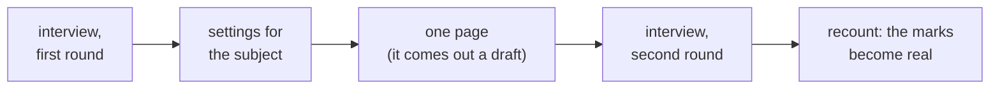

<div align="center">

# tutor-skills

**A personal tutor you assemble for your own subject** — mathematics, React, physics, chemistry, history.

[](.claude-plugin/plugin.json)
[](https://docs.claude.com/en/docs/claude-code/overview)
[](LICENSE)

**English** · [Русский](README.ru.md) · [简体中文](README.zh-CN.md) · [한국어](README.ko.md) · [日本語](README.ja.md) · [Français](README.fr.md) · [Deutsch](README.de.md)

</div>

This is not a notes folder, and not a thing that summarises books at you.

You build yourself a textbook for your own subject. It holds two things: **pages** — one per idea — and a **route** that says which order to go through them in, and why that order.

Every page carries a mark: how far you can trust what is written on it. A script puts that mark there — it counts sources and passing checks. Nobody can type it in by hand, and that is the whole point.


*This is what a page looks like. The screenshots are from a demo page in English; a base in any other language looks exactly the same, in that language.*

## Quick start

Make an empty folder, open Claude Code in it, and paste this:

> Install and deploy this project locally: https://github.com/Hr0mE/tutor-skills — we are going to adapt it for learning `<YOUR_SUBJECT>`.

Put what you want to learn in place of `<YOUR_SUBJECT>` — or **paste the line exactly as it stands**. Then you will be asked what you want to learn before anything else is asked. That is a supported path, not a mistake.

The rest happens on its own: the plugin installs, the machine is checked for whether it can run the kind of verification your subject needs, and the interview starts. It happens in the language you write in — you will be asked about that too.

Step by step, at length: [docs/INSTALL.md](docs/INSTALL.md).

<details>
<summary><b>For the agent deploying this</b> — the six steps, and what to say when they are done</summary>

**1. Install.** The repo is its own marketplace.

```bash
claude plugin marketplace add Hr0mE/tutor-skills
claude plugin install tutor-skills@tutor-skills
```

`/plugin marketplace add …` works too where the slash command is available; it is not exposed in every environment. Newly installed skills appear only after a session restart — say so rather than letting the learner conclude it failed.

**To update an existing install**, prefer `claude plugin update tutor-skills@tutor-skills`; if it reports "already the latest version" while the repository has moved, uninstall and install again. The updater compares the `version` field, so a release published without a version bump is invisible to it.

**2. Settle the language before saying anything else.** Default to the language the learner is writing to you in — that signal is in the conversation and needs no permission — and confirm it with one structured question rather than assuming. Everything after it, greeting included, happens in that language. This matters more since the scan boundary went in: the language used to be inferred from the learner's existing pages, and once that reading stopped, English became the accidental default for people who had never written a word of it here.

**3. If they have not said what they want to learn, ask — before anything else you were going to say.** The line above ships a `<YOUR_SUBJECT>` placeholder and it gets pasted intact; a learner who did that has told you they want a tutor and nothing at all about what for. Ask it straight after the language, as one open question, and **never infer it** from the folder name, the files on disk or anything else — the boundary that would permit that reading has not been set yet, and every later answer is built on this one. `/learning-init` carries the wording and the order that follows it. Where the subject *was* named, say it back once while settling the language and carry on as normal.

**4. Preflight, and note the platform.** On Windows there is no `make` and the scaffold does not write one — commands are `python tutor.py <command>`, and the Store build of Python is the usual cause of a failed setup (install python.org Python, or `uv`). On macOS `make` needs the Xcode command line tools, so prefer `tutor.py` rather than triggering that prompt. The scaffold records the correct form in the project's `CLAUDE.md` §0; use what it says instead of assuming `make`. Then check what this machine can actually do, because the answers depend on it, not the other way round: `uv`, or a `python3` whose `-m venv` can bootstrap pip; and the subject's own toolchain — a test runner, a compiler, Tesseract for a book corpus. **Report blockers before the interview, not after.** A strictness setting that assumes checks can run, on a machine where they cannot, produces a base where every page sits at `sourced` forever.

**5. Ask what you may look at, then look.** Grounding the interview in what is on the machine is also a stranger reading someone's work, so the boundary is set first — a checkbox question, one click, before any enumeration. Inside it, never ask for what you could find yourself; outside it, ask and say why. `/learning-init` carries the exact wording and records the answer in the domain layer, where every later session is bound by it.

**6. Hand off to `/learning-init`.** It opens with the orientation itself — what is installed, what this is, what they can do with it, what happens next — so do not write your own version here; the canonical text is in the skill and one copy is enough to keep them from drifting apart.

---

</details>

## What it makes

| Folder | What is in it |
|---|---|
| `wiki/concepts/` | The pages. One per idea, and every explanation of that idea in a single file, one after another |
| `wiki/tracks/` | The route. Which order to go through the pages in, and why that one |

A reference book read straight through turns to mush: everything is in there, but what it was for is gone. A course cut into separate cards loses the thread. So both are here: a page can be taken on its own and reused in another topic, and the route holds the argument between them.

**A page explains the same thing three times over**, and moving from one explanation to the next is what learning actually is:

- **through an everyday example** — what it resembles in ordinary life, followed immediately by a paragraph on where the example lies;
- **how it is used** — the definition and the smallest example that shows why the thing exists at all;
- **in full** — the exact statement with all its conditions, and how it works underneath.

Then comes practice. First two or three short warm-ups, then the problems. Each problem carries three collapsed hints: you unfold one at a time, and only when you are stuck. The answers live in a separate file, so your eye cannot land on them by accident.

## Three ideas worth stealing even if you never install this

**A comparison with no stated limits is worse than no comparison at all.** The everyday example must be followed by a paragraph saying where it stops holding. Without it the example installs itself as fact and obstructs for years — invisibly, because it never announced that it was a simplification. Here this is not advice: a page carrying a comparison and no limits fails the check.

**The trust mark is written by a script, never by a person.** It does not measure how sure the writer felt; it measures what can be counted — how many sources, how many checks passed. The moment it can be set by hand it drifts upward and stops meaning anything. An inflated scale is worse than none, because it is still believed.


**Two sources are not always two sources.** Two textbooks retelling the same book are one source counted twice. Two articles about the same page of documentation, likewise. What counts as two separate sources is decided per subject: two different proofs, two witnesses who have not read each other, or code actually run against what the documentation promises. The script counts only sources that do not declare themselves derived from another.

## Where your subject's settings come from

The plugin knows how to teach, but it does not know your subject: what counts as a source here, what counts as a check, and what tells you a topic is finished. That gets settled in an interview — and the interview runs **in two rounds, with a real page written in between**.



The cut is not placed at random. The first round asks what can be known in advance. The second asks what only real material can show. "What counts as two separate sources in your subject?" looks like a clear question right up until you try to answer it seriously: before the first page the answer is plausible and wrong; after it, the answer is real.

A page written before the second round is marked a draft whatever backs it up: the rules it would be judged by did not exist yet. The second round lifts that ceiling and recounts everything.

The method itself lives in the plugin and updates with it. Only the settings for your subject land in your folder. So when the method improves, the improvement reaches every base you have already started — instead of leaving you with five frozen copies of it.

## Problems

Three per page, each with its own job: **hold the definition** · **apply the result** · **break the condition** — remove one hypothesis and watch what collapses. The third one cures the most common confusion in any subject: which condition carries the construction, and which is only standing there.

A problem statement on its own is not enough. Someone stuck with nothing to hold onto simply closes the page. So the problem is preceded by **short exercises** — not pieces of the solution, but a check that the tool you need is in your hand. And inside the problem, **three hints of increasing strength**: where to look · what to use · nearly the whole construction, leaving only the arithmetic.


## When you disagree with a line

The objection goes into the `audit/` folder, not into the chat. What is said in a conversation dies with that conversation. A note in `audit/` is anchored to a specific passage of a specific page, processed as its own piece of work, and archived together with its resolution — **rejections included, with the reason for rejecting**. Nothing is deleted.

## If you learn from books

For subjects learned from books, the book machinery switches on: search across all your books at once, and the page offset worked out automatically. Page 91 of the file is, say, page 79 of the book; a reference that ignores this is twelve pages out, and then nobody can check it.

The text a program pulls out of a scan is good only for finding the place. Anything entering the base as a quotation is checked by eye against the image of the page: character recognition mangles indices, quantifiers and Greek letters, and a mangled formula wearing a "verified" mark is the worst thing this system can produce.

## The five types of check

Fixed in the core. A subject declares which it can attain; it never invents a sixth.

| | Buys you |
|---|---|
| `formal` | A guarantee — symbolic identity, type check, dimensional analysis |
| `behavioral` | An observation on one concrete version |
| `illustrative` | A refutation. A counterexample demonstrates; it does not prove |
| `attested` | That the source was **not misquoted** — not that the claim is true |
| `contested` | A page status: the sources disagree, and that disagreement is the content |

`attested` is what keeps the scale alive in subjects where nothing is executable. It is machine-checkable — the quoted words are on the cited page or they are not — and it is the only thing a machine can honestly certify about a documentary claim.

## Status

**Early.** The method grew out of one mathematics track carried to the end and is being reworked to fit any subject. The settings will still move.

Requires Claude Code and Python 3.10 or newer. `make` is optional and does not exist on Windows at all — everything there goes through `python tutor.py <command>`. See [NOTICE](NOTICE) for what this is built on. MIT licensed.
