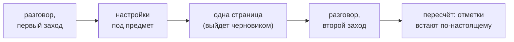

# tutor-skills

**Персональный репетитор, которого ты собираешь под свой предмет** — математику, React, физику, химию, историю.

[English](README.md) · **Русский** · [简体中文](README.zh-CN.md) · [한국어](README.ko.md) · [日本語](README.ja.md) · [Français](README.fr.md) · [Deutsch](README.de.md)

Это не заметки и не пересказ книг.

Ты собираешь себе учебник по своему предмету. В нём две вещи: **страницы** — по одной на каждую идею — и **маршрут**, который говорит, в каком порядке их проходить и почему именно в таком.

На каждой странице стоит отметка: насколько тому, что там написано, можно верить. Её ставит программа — она считает источники и пройденные проверки. Руками эту отметку не выставить, и в этом весь смысл.

*Так выглядит страница. Скриншоты сняты с англоязычной демо-страницы — русская база выглядит точно так же, только по-русски.*

## Начать за минуту

Создай пустую папку, открой в ней Claude Code и вставь туда это:

> Установи и разверни этот проект локально: https://github.com/Hr0mE/tutor-skills — будем адаптировать под изучение `<ТВОЙ_ПРЕДМЕТ>`.

Впиши свой предмет вместо `<ТВОЙ_ПРЕДМЕТ>` — или **вставь строку как есть**. Тогда тебя просто спросят, чему ты хочешь научиться, прежде чем спрашивать что-либо ещё. Так тоже правильно.

Дальше всё делается само: ставится плагин, проверяется, потянет ли твой компьютер нужные проверки, и начинается разговор. Говорить с тобой будут на том языке, на котором ты пишешь, — про язык тоже спросят.

Подробно и по шагам: [docs/INSTALL.md](docs/INSTALL.md) *(пока только по-английски)*.

## Что получится

| Папка | Что в ней |
|---|---|
| `wiki/concepts/` | Страницы. По одной на идею, и все объяснения этой идеи — в одном файле, подряд |
| `wiki/tracks/` | Маршрут. В каком порядке идти по страницам и почему в таком |

Справочник, который читаешь подряд, превращается в кашу: всё есть, а зачем — непонятно. Курс, разрезанный на отдельные карточки, теряет нить. Поэтому здесь и то и другое: страницу можно взять отдельно и использовать в другой теме, а маршрут держит связь между ними.

**Одну и ту же вещь страница объясняет три раза подряд**, и переход от объяснения к объяснению — это и есть учёба:

- **на бытовом примере** — на что это похоже из обычной жизни, и сразу следом абзац о том, где пример врёт;
- **как этим пользуются** — определение и самый маленький пример, ради которого штука вообще нужна;
- **полностью** — точная формулировка со всеми условиями и как оно устроено внутри.

Дальше практика. Сначала пара коротких упражнений на разогрев, потом задачи. У каждой задачи три подсказки, свёрнутые в блоки: разворачиваешь по одной и только когда встал. Ответы лежат в отдельном файле, чтобы не наткнуться на них взглядом раньше времени.

## Три идеи, которые стоит забрать себе, даже если ты это не поставишь

**Сравнение без границ хуже, чем никакого сравнения.** За бытовым примером обязан идти абзац о том, где он перестаёт работать. Без такого абзаца пример запоминается как факт и мешает потом годами — причём незаметно, ведь он не предупредил, что был упрощением. Здесь это не пожелание: страница с примером и без границ не проходит проверку.

**Отметку «насколько можно верить» ставит программа, а не человек.** Она считает не уверенность того, кто писал, а то, что можно посчитать: сколько источников и сколько проверок прошло. Как только такую отметку разрешают ставить руками, она начинает ползти вверх и перестаёт что-либо значить. Завышенная отметка хуже, чем никакой: ей всё ещё верят.

**Два источника — это не всегда два источника.** Два учебника, пересказывающих одну и ту же книгу, — это один источник, посчитанный дважды. Две статьи по одной странице документации — тоже. Что считать разными источниками, решается отдельно для каждого предмета: два разных доказательства, два свидетеля, которые друг друга не читали, или запуск кода против того, что обещано в документации. Программа засчитывает только те источники, которые не помечены как пересказ другого.

## Откуда берутся настройки под твой предмет

Плагин умеет учить, но твоего предмета он не знает: что здесь считать источником, что считать проверкой и по чему видно, что тема закрыта. Это выясняется в разговоре — и разговор идёт **в два захода, а между ними ты пишешь одну настоящую страницу**.

Разрыв тут не случайный. В первый заход спрашивают то, что можно знать заранее. Во второй — то, что становится видно только на живом материале. Вопрос «что в твоём предмете считать двумя разными источниками?» звучит понятно ровно до попытки ответить на него всерьёз: до первой страницы ответ получается правдоподобным и неверным, после — настоящим.

Страница, написанная до второго захода, помечается черновиком, чем бы она ни была подкреплена: правил, по которым её судить, тогда ещё не было. Второй заход снимает этот потолок и пересчитывает всё заново.

Сам метод лежит в плагине и обновляется вместе с ним. В твою папку попадают только настройки под предмет. Поэтому, когда метод становится лучше, это доезжает до всех баз, которые ты уже начал, — а не оставляет тебя с пятью замороженными копиями.

## Задачи

По три на страницу, и у каждой своя работа: **удержать определение** · **применить результат** · **сломать условие** — убрать одну посылку и посмотреть, что развалится. Третья лечит самую частую путаницу в любом предмете: где условие держит всю конструкцию, а где оно стоит просто так.

Одного условия задачи мало. Тот, кто застрял и кому не за что взяться, просто закрывает страницу. Поэтому перед задачей идут **короткие упражнения** — это не куски решения, а проверка, что нужный инструмент у тебя в руках. А в самой задаче — **три подсказки по нарастанию**: куда смотреть · чем это делается · почти всё построение, остаётся довести до ответа.

## Если ты с чем-то не согласен

Возражение пишется в папку `audit/`, а не в чат. Сказанное в разговоре умирает вместе с разговором. Замечание в `audit/` привязано к конкретному месту конкретной страницы, разбирается как отдельная работа и уходит в архив вместе с решением — **включая отклонённые, с объяснением, почему отклонили**. Не удаляется ничего.

## Если учишься по книгам

Для предметов, которые учат по книгам, включается работа с ними: поиск сразу по всем твоим книгам и автоматический пересчёт номеров страниц. 91-я страница файла — это, скажем, 79-я страница книги; ссылка, которая этого не учитывает, промахивается на двенадцать страниц, и проверить её не сможет никто.

Текст, который программа вытащила из скана, годится только чтобы найти нужное место. Всё, что попадает в базу цитатой, сверяется глазами по картинке страницы: распознавание регулярно калечит индексы, значки и греческие буквы, а испорченная формула с отметкой «проверено» — худшее, что эта штука способна выдать.

## Что пока только по-английски

Здесь переведено главное. Подробности лежат в английских файлах:

- [Пять видов проверки](README.md#the-five-types-of-check) — от «доказано» до «цитата на месте», и почему шестой вид не заводится.
- [docs/INSTALL.md](docs/INSTALL.md) — установка, оба разговора целиком на живом примере, ежедневные команды и что делать, когда что-то не работает.
- [NOTICE](NOTICE) — на чём это построено и кому мы этим обязаны.

<b>Агенту, который это разворачивает</b>

Инструкции по развёртыванию — в английском README, раздел [*For the agent deploying this*](README.md#quick-start). Они **намеренно не переводятся**: это инструкции модели, а не текст для чтения человеком. Пять переведённых копий одних и тех же инструкций разъедутся на первой же правке, и разъехавшуюся заметят последней.

Переводится то, что читает человек. На каком языке говорить с учеником — решается не языком файла: это отдельный первый шаг `/learning-init`, и по умолчанию берётся тот язык, на котором ученик пишет сам.

## Состояние

**Ранняя версия.** Метод вырос из одного законченного курса по математике и сейчас переделывается так, чтобы годиться для любого предмета. Настройки ещё будут меняться.

Нужны Claude Code и Python 3.10 или новее. `make` не обязателен, а на Windows его нет вообще — там всё идёт через `python tutor.py <команда>`. Лицензия MIT.
