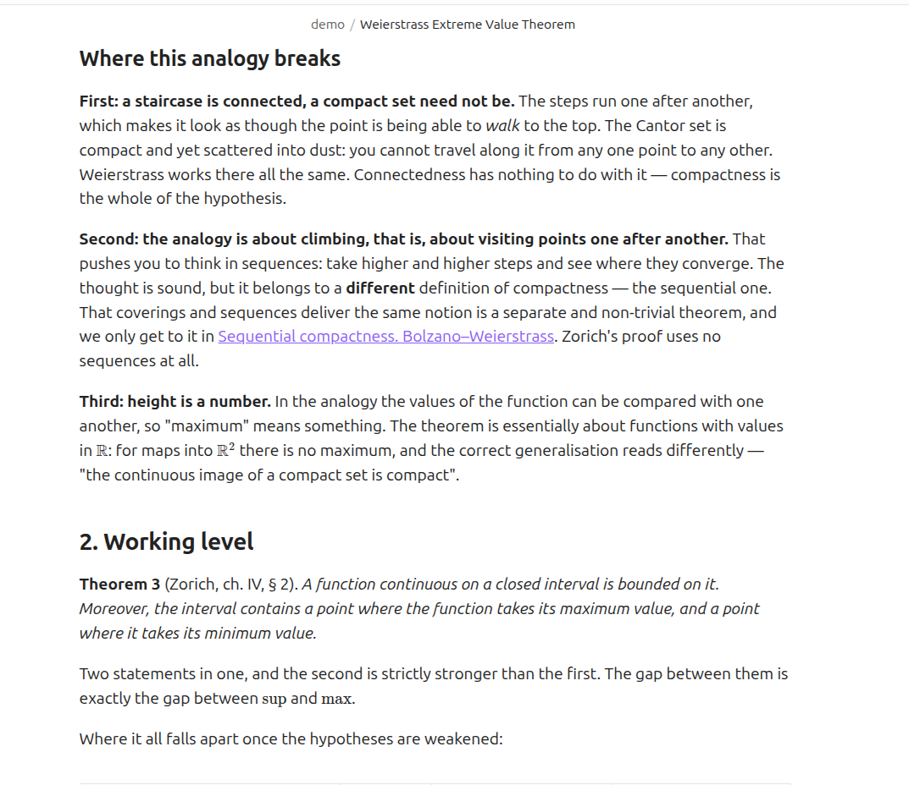
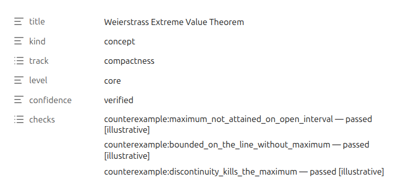
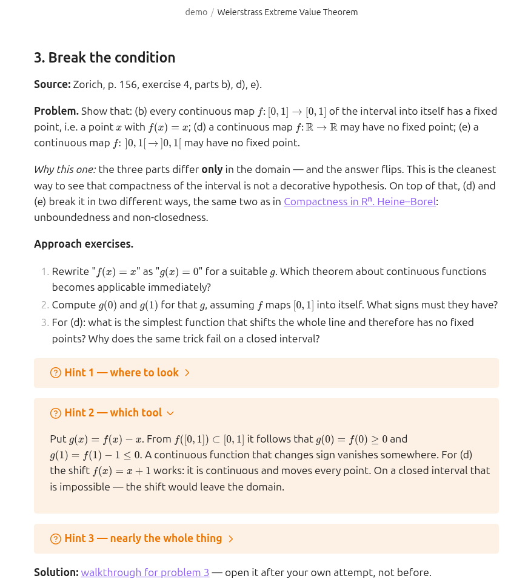

# tutor-skills

**为你自己的学科亲手组装的私人导师** —— 数学、React、物理、化学、历史。

[English](README.md) · [Русский](README.ru.md) · **简体中文** · [한국어](README.ko.md) · [日本語](README.ja.md) · [Français](README.fr.md) · [Deutsch](README.de.md)

这不是笔记工具，也不是把书讲给你听的东西。

你在为自己的学科搭一本教材。里面有两样东西：**页面** —— 一个想法一页 —— 和**路线**，它告诉你按什么顺序读这些页面，以及为什么是这个顺序。

每一页上都有一个标记：这一页写的东西有多可信。标记由程序打 —— 它数的是来源和通过的检查。人手写不进去，这正是全部的意义。

*页面就是这个样子。截图取自英文示例页面 —— 中文的知识库长得一模一样，只是文字是中文的。*

## 三十秒上手

新建一个空文件夹，在里面打开 Claude Code，把下面这句粘进去：

> 请在我的机器上安装并部署这个项目：https://github.com/Hr0mE/tutor-skills —— 我们要把它调整成学习 `<你的学科>` 用的。

把 `<你的学科>` 换成你要学的东西 —— 或者**原样粘贴**。那样它会先问你想学什么，然后才问别的。这样也是对的。

接下来的事它自己做：装插件、检查你的机器能不能跑起需要的检查、开始对话。它会用你写字时用的语言跟你说话 —— 语言这件事它也会问。

一步一步的详细版本：[docs/INSTALL.md](docs/INSTALL.md) *（目前只有英文）*。

## 你会得到什么

| 文件夹 | 里面是什么 |
|---|---|
| `wiki/concepts/` | 页面。一个想法一页，这个想法的所有解释都在同一个文件里，一个接一个 |
| `wiki/tracks/` | 路线。按什么顺序走这些页面，以及为什么是这个顺序 |

一本从头读到尾的参考书会变成一锅粥：什么都有，但不知道为什么要有。被切成一张张卡片的课程会丢掉线索。所以这里两样都在：页面可以单独拿出来用在别的主题里，而路线把它们串成一条道理。

**同一件事，一页里讲三遍**，而从一遍到下一遍的过渡，本身就是学习：

- **用日常的例子** —— 它像生活里的什么，紧接着一段说明这个例子在哪里不成立；
- **实际怎么用** —— 定义，以及能说明它为什么存在的最小例子；
- **完整版本** —— 带全部条件的精确表述，以及它内部是怎么运作的。

再往后是练习。先是两三道热身小题，然后是正式题目。每道题有三条提示，折叠成小块：卡住了才展开一条。答案放在另一个文件里，免得眼睛不小心扫到。

## 三个值得拿走的想法，哪怕你永远不装这个东西

**没有标出边界的类比，比没有类比更糟。** 日常例子后面必须跟一段话，说明它在哪里不再成立。没有这段话，例子会被当成事实记住，然后悄悄妨碍你很多年 —— 因为它从没说过自己只是个简化。这里这不是建议：带类比却没写边界的页面通不过检查。

**「有多可信」这个标记由程序来打，不由人来打。** 它算的不是写的人有多自信，而是能数的东西：几个来源，几项检查通过了。一旦允许人手写这个标记，它就会往上爬，然后不再意味着任何东西。虚高的标记比没有标记更糟，因为人们照样相信它。

**两个来源不一定就是两个来源。** 两本复述同一本书的教科书，是同一个来源数了两次。两篇讲同一页文档的文章也是。什么算不同的来源，每个学科要单独决定：两个不同的证明，两个互相没读过对方的证人，或者把代码跑起来去对照文档的承诺。程序只承认那些没有标明「转述自另一处」的来源。

## 针对你学科的设置从哪来

插件会教，但它不知道你的学科：这里什么算来源，什么算检查，凭什么判断一个主题算学完了。这些在对话里问清楚 —— 而对话**分两轮，中间你要写一页真正的页面**。

这个断口不是随便放的。第一轮问的是事先就能知道的事；第二轮问的是只有碰过真材料才看得见的事。「在你的学科里，什么算两个不同的来源？」这个问题听上去很清楚，直到你认真去答：在写出第一页之前，答案听着有道理，其实是错的；写完之后，答案才是真的。

第二轮之前写的页面一律标成草稿，不管它有多少支撑：那时候用来评判它的规则还不存在。第二轮把这个上限撤掉，然后重新算一遍。

方法本身在插件里，跟着插件更新。落到你文件夹里的只有学科设置。所以方法变好的时候，好处会到达你已经开始的每一个知识库 —— 而不是留给你五份冻住的复制品。

## 题目

每页三道，各有各的活：**握住定义** · **用上结论** · **把条件弄坏** —— 去掉一个前提，看看什么塌了。第三道治的是任何学科里最常见的糊涂：哪个条件撑着整个结构，哪个只是摆在那儿。

只有题目是不够的。卡住又无处下手的人，会直接关掉页面。所以题目前面有**几道小练习** —— 它们不是解答的片段，而是检查你手里有没有那件工具。题目里则有**三条逐级加深的提示**：往哪看 · 用什么做 · 几乎整个构造，只剩把答案算出来。

## 如果你不同意某句话

反对意见写进 `audit/` 文件夹，而不是写在聊天里。聊天里说过的话会跟那段聊天一起消失。`audit/` 里的一条意见绑在某一页的某个具体位置上，会被当成一件独立的工作来处理，然后连同处理结果一起归档 —— **包括被否决的，连同否决的理由**。什么都不会被删掉。

## 如果你靠书学习

对于靠书学的学科，会打开一套跟书打交道的东西：一次搜索你所有的书，以及自动换算页码。文件里的第 91 页，可能是书上的第 79 页；不管这一点的引用会差十二页，谁也没法核对。

程序从扫描件里认出来的文字，只够用来找地方。任何以引文形式进入知识库的东西，都要对着页面图片用眼睛核一遍：识别经常把下标、符号和希腊字母弄坏，而一个被弄坏的公式还带着「已核实」的标记，是这套东西能产出的最糟糕的结果。

## 目前只有英文的部分

这里翻译的是主干。细节在英文文件里：

- [五种检查](README.md#the-five-types-of-check) —— 从「已证明」到「引文确实在那一页上」，以及为什么不设第六种。
- [docs/INSTALL.md](docs/INSTALL.md) —— 安装、两轮对话的完整实例、日常命令，以及出问题时怎么办。
- [NOTICE](NOTICE) —— 这东西建立在什么之上，以及我们欠谁的。

<b>给部署它的智能体</b>

部署说明在英文 README 的 [*For the agent deploying this*](README.md#quick-start) 一节。它们**故意不翻译**：那是给模型看的指令，不是给人读的文字。同一份指令的六个译本会在第一次修改时就开始分叉，而分叉的那一份总是最后才被发现。

翻译的是人读的东西。用什么语言跟学习者说话，不由文件的语言决定：那是 `/learning-init` 单独的第一步，默认取学习者自己写字时用的语言。

## 状态

**早期版本。** 这套方法从一门已经走完的数学课程里长出来，现在正在改造成可以用于任何学科。设置还会变。

需要 Claude Code 和 Python 3.10 或更新的版本。`make` 不是必需的，Windows 上根本没有 —— 那里一切都通过 `python tutor.py <命令>` 走。MIT 许可证。
